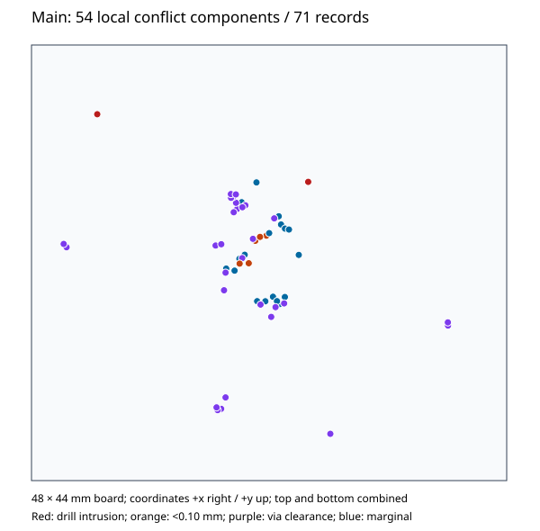

# EDA-003D — latest-stock Main clearance risk triage

**BACKEND_DECISION_REQUIRED.** Stage 1 is **BROAD / DISTRIBUTED**. The accepted
71 Main records do contain duplicates, but do not collapse into a handful of
physical conflicts: geometric classification retains **54 local conflict
components across 37 distinct net/NC pairs**. Five candidate responsibility
hypotheses remain unlocalized. This is a terminal Kill Gate result, not a
clearance PASS or a decision to abandon tscircuit.

The largest physical cluster explains **6/71 records (8.45%)**; the three
largest explain **14/71 (19.72%)**. Stable geometry is accepted from EDA-003C,
but stable failure does not establish a small repair surface. Stop before
representative selection, minimization, internal responsibility investigation,
upstream comparison or patching. Wing keepout and Main export were not entered.

## Authority and retained input

Mandatory preflight passed before editing: cwd `/workspaces/he-piantor-42`,
clean tree, branch `eda-003d-main-clearance-risk-triage`, HEAD and merge-base
with `origin/main` both `820e7d7a99aa8c078f88ce3d0602b7ff4f4399f8`, production
**tscircuit 0.0.2646**. [Issue #65](https://github.com/ihsinoky/he-piantor-42/issues/65)
was read completely; it had no comments. No applicable repository AGENTS.md
exists. Required reports, status, decisions, five EDA-003C evidence files,
isolated latest-stock setup/collection scripts, representative source and
existing physical verifiers were read. The initial CLI network read failed;
the GitHub connector supplied the complete issue and all comments.

The primary input is the accepted lossless Main Circuit JSON in
[EDA-003C raw evidence](../hardware/tscircuit/qualification/eda-003c/evidence/raw/).
Its uncompressed SHA-256 remains
`97d51d510ecc7096261ad36297b48939609a14435a24926967b61197ed951131`.
The classifier decompresses in memory. Public stock placement/routing checks
from the existing isolated **0.0.2748** installation run on a clone and reproduce
all **71** accepted type/message records in order. No routing or export runs
were performed, and no accepted evidence was modified.

EDA-003C's **zero wrong-net copper components**, **zero required unrouted
connections** and two fresh processes with byte-identical Main geometry remain
accepted. This investigation found no new unrelated-net copper contact and did
not reopen wrong-net work. Generated diagnostics are not counted again on top
of replayed stock checks.

## Physical classification

| Accepted checker population | Raw records | Local components containing that type |
| --- | ---: | ---: |
| Pad-pad | 1 | 1 |
| Pad-trace | 19 | 16 |
| Via-trace | 32 | 32 |
| Trace-clearance | 17 | 15 |
| Via-hole / SMD-pad | 2 | 2 |
| Total | **71** | **54 distinct components** |

The component column overlaps across types and must not be summed. Individual
records can cover multiple disconnected physical regions. In particular, the
single pad-pad record is **via `pcb_via_92` against `U_MCU.UNUSED8`**, not two
source pads. The two placement records are same-net drill intrusions at
`U_FLASH.CS` and `J_USB.A4_B9`; they are not unrelated-net shorts.

[Normalized records](../hardware/tscircuit/qualification/eda-003d/evidence/error-records-normalized.json)
retain checker IDs/messages, material object IDs, net/NC identity, source trace
and component/port identity, stock-autogenerated status, rules, layers, segment
endpoints/widths, pad/via geometry, actual spacing and every below-rule primitive
pair covered by each diagnostic. The 71 records cover **431 primitive-pair
observations**, including adjacent segments and repeated copper in separate
trace IDs. NC lands remain physical obstacles and retain explicit NC identity.
The sole Main source-authored shell bond is distinguished from stock routes.

Clustering uses analytical rectangle/circle/capsule distances. It merges only
when an explicit witness proves that both sides of two same-layer/same-net-pair
conflicts share copper and a below-rule conflict region. Adjacent segments join
only through a proved continuous violating corridor. Convex intersection
projections handle witnesses away from endpoints; every accepted merge witness
is checked against the original primitives. Shared IDs, similar messages,
nearby coordinates or common net names alone cannot merge conflicts.

The resulting **54** is a conservative local conflict-component count under
this documented witness method, not a claim of an exhaustive board-wide DRC
or a mathematically exhaustive topology solver. Finite numerical feasibility
search could leave an unresolved merge. Increasing its iteration budget fivefold
leaves component membership, geometry and normalized records identical;
equally valid merge-witness choices can differ. Repeats at the normal budget
are byte-identical. Independently, **37 distinct net/NC pairs**
remain even if further same-pair joins were proved; that lower bound already
precludes a handful of physical pair conflicts. The broad decision does not
hinge on a borderline numerical split.

[Physical clusters and risk order](../hardware/tscircuit/qualification/eda-003d/evidence/physical-fault-clusters.json)
include object/primitive IDs, layers, locations, minimum spacings, raw-record
membership and geometric merge proofs. Examples:

- **C012:** V1V1/V3V3 near MCU PWR44, minimum **0.185 mm** under **0.20 mm**.
  Four trace-trace and two pad-trace records share this local conflict.
- **C009:** USB_DM/V1V1, minimum **0.185 mm** under **0.20 mm**.
  Three trace-trace records and one pad-trace record collapse together.
- **C006:** QSPI_SD3/V1V1, minimum **0.085170 mm** under **0.20 mm**.
  Trace, pad and via diagnostics share a connected local clearance region.
- **R007:** USB_DM/USB_DP generates two separate local regions, C007/C008.
  A trace-pair record is therefore not automatically one independent fault.

Stock trace-trace messages retain the first reported segment-pair gap, rather
than necessarily the worst gap on the route pair. Full primitive enumeration
finds **0.083793 mm** in C017 (MUX_A1/MUX_A2), although that record's message
reports approximately **0.179 mm**. Original messages remain intact; computed
minima are separate fields. Pad/via checker numeric minima agree with the
independent geometric calculation within 0.0000001 mm.



The map combines layers and plots each component's minimum-gap witness location;
coincident markers can overlap. It is a forensic map, not routed board artwork.
Locations span approximately x −20.75..18.07 mm and y −17.27..15.01 mm.

## Risk ranking and candidate responsibility

Ranking preserves prohibited hole intrusion/contact first, then gaps below
0.10 mm, via conflicts and ordinary marginal clearance. The 0.10 mm ranking
threshold does not change any design/check rule. The highest-ranked observations
are C002 and C001's same-net drill intrusions, followed by the smallest copper
clearances. C054 is a via-to-NC-pad clearance of **0.057891 mm** under **0.10 mm**;
C017 is unrelated-net trace clearance of **0.083793 mm** under **0.20 mm**.
C036 is via-to-unrelated-net trace clearance of **0.084677 mm** under **0.20 mm**.
No representative is selected after the broad STOP.

C001's hole edge intrudes approximately **0.104840 mm** into the CS pad.
C002's drill center lies inside its VBUS pad. The classifier's −0.15 mm value
for that contained circle is an **intrusion indicator**, not an exact polygon
penetration depth. Unsigned material distance is zero; the stock no-via-in-pad
condition is violated. Required contact exclusion is recorded separately from
positive clearance requirements. Neither case establishes a new electrical short.

[Candidate families](../hardware/tscircuit/qualification/eda-003d/evidence/root-cause-families.json)
separate inferred responsibility from proved clustering:

| Candidate hypothesis | Diagnostic allocation | Confidence |
| --- | ---: | --- |
| Same-net endpoint via placement fails no-via-in-pad intent | 2 | Low |
| MCU escape/pad obstacle or subsequent geometry has insufficient margin | 19 | Low |
| Via annulus clearance budget/inter-route interaction or later mutation | 32 | Low |
| Inter-route spacing or later cleanup, including overlapping pad diagnostics | 17 | Low |
| NC-pad obstacle treatment, potentially shared with other pad/via cases | 1 | Low |

These are **five candidate hypotheses, zero proven root causes**. Allocation
by diagnostics makes coverage reviewable; it does not establish five distinct
solver defects. Hypotheses may merge or split after internal localization,
and clusters can belong to multiple hypotheses. No routing phase is blamed
from final geometry alone.

There is a useful recurring signature: **15/71 records (21.13%)**, or 15 of
32 via-trace records, have minima within 0.0003 mm of **0.115 mm**. A shared
clearance-budget defect is plausible. Other via-trace minima range down to
0.084677 mm and up to 0.179152 mm. The numeric band describes a pattern,
not a merge tolerance or a relaxed rule. MCU pad plus trace diagnostics together
account for **36/71 (50.70%)**, but grouping that whole symptom population as
one cause would assume the conclusion being tested. Neither observation proves
a single repair boundary or explains the prohibited drills and NC-pad case.

## Stage 1 and cost Kill Gates

**BROAD / DISTRIBUTED:** proven physical conflicts remain numerous, distributed
across 37 pairs, MCU escape/inter-route copper, remote vias and two same-net
SMD drill intrusions. No dominant **causal** family or narrow responsibility
boundary is established. This is a conservative project cost judgment from
captured geometry, not proof that all five hypotheses need separate fixes.
Determinism supports repeatability but does not make the repair bounded.
A common correction could eventually resolve more than one population; this
Stage 1 evidence does not justify assuming that outcome.

The [cost checkpoint](../hardware/tscircuit/qualification/eda-003d/evidence/cost-checkpoint.json)
was recorded before any further investigation cycle:

- 71 raw records; 54 local components; 37 pair lower bound; five candidate hypotheses.
- Dominant cluster: 8.45%; top three clusters: 19.72% of raw records.
- Largest diagnostic hypothesis: via-trace, 45.07%; causal coverage unproved.
- Representative/reduction: **not entered**, as required by the Stage 1 STOP.
- Root-cause localization: **LOW**; final material geometry known, earliest
  invalid internal boundary unknown. Input inflation, raw solver, stitching,
  conversion and checker/router semantics were not investigated.
- Repair size: **UNKNOWN**. Potential responsibility repositories are
  `tscircuit/core`, `tscircuit/capacity-autorouter` and `tscircuit/checks`;
  actual repositories/modules/files needing changes are unknown. This is not
  a claim that a fix necessarily spans all three. No patch exists, so no
  speculative line count or narrow fork maintenance estimate is provided.
- Full-board check replay is feasible; a minimal stock-routing regression,
  upstream suitability and safe project/fork repair remain **unqualified**.
- Additional-fault risk is substantial. A checker record can hide several
  regions and this classification is not an exhaustive replacement DRC.
- Another cycle is not justified under this issue's Kill Gate. The recurring
  via signature remains a concrete lead for separately authorized, budgeted work.

No Stage 2–4 evidence files are fabricated. No minimal reproducer was attempted
or claimed unstable; no root-cause boundary or upstream match was claimed.
Upstream searches and disposable proof-of-fix were not entered. Accepted errors
remain material; no check was suppressed and no clearance was weakened.

**Next Human Gate question:** should the PO authorize one separately budgeted
investigation of the recurring via-clearance signature, or move to alternate
backend/router evaluation or tscircuit NO-GO before any lower-priority Kill Gate?
This report authorizes none of those implementation paths and no production upgrade.

## Reproduction and validation

From the repository root, with Python 3 and Node available and the accepted
EDA-003C latest-stock dependencies already installed:

```sh
node hardware/tscircuit/qualification/eda-003d/capture-checks.mjs
python3 hardware/tscircuit/qualification/eda-003d/classify.py
python3 hardware/tscircuit/qualification/eda-003d/summarize.py
python3 hardware/tscircuit/qualification/eda-003d/validate.py
```

Install only the committed EDA-003C isolated lock if those dependencies are
absent; do not run its screening or prepare scripts to perform this read-only
triage. Nothing requires Bun, a new router process or the four-process qualification.

Validation covers JSON/SVG parsing, all 71 records, all 431 primitive-pair
observations, geometric merge proofs, deterministic clustering at 800/4000
projection iterations, 14 adversarial classifier tests, exact stock diagnostic
replay, protected baseline bytes and `git diff --check`. Unit fixtures exercise
contact, pad intrusion, duplicated copper IDs, separate regions on the same
via, distant same-net conflicts, layer/net separation and continuous route
joints. Passing classifier validation does not pass physical board clearance.

Production `hardware/tscircuit/package.json` and `package-lock.json` remain
byte-identical to baseline, including **tscircuit 0.0.2646**. All tracked accepted
EDA-003C and historical EDA-003B files remain byte-identical. No stock package
was patched, generated Circuit JSON edited, permanent fork created, external
router used, upstream Issue/PR submitted, full Rev.M1 implemented or manufacturing
release approved. The issue PR is for review only and must not be merged by this task.
